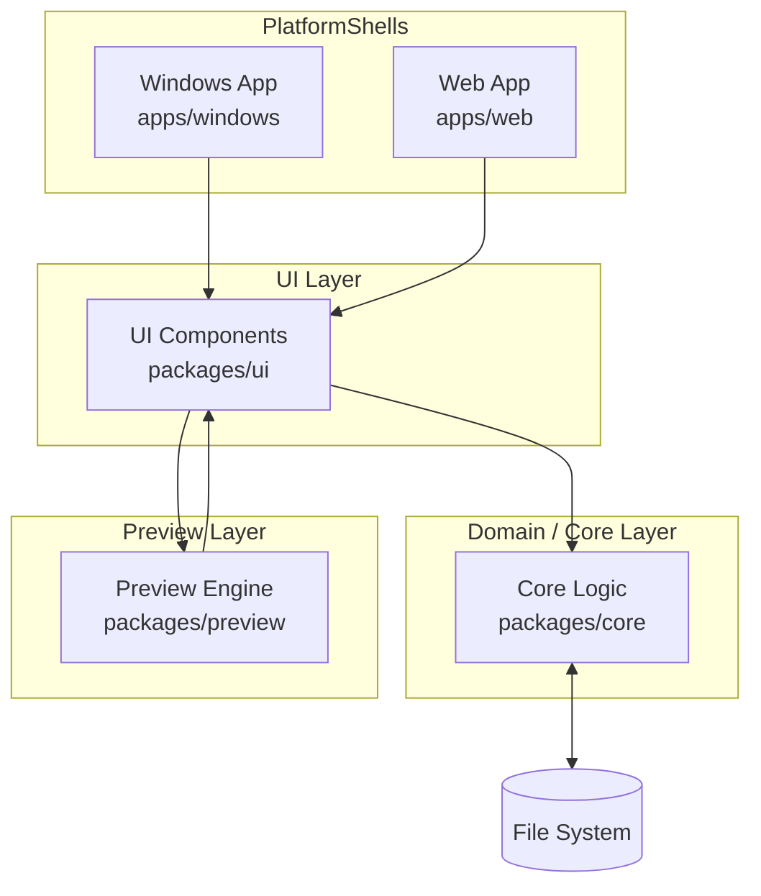
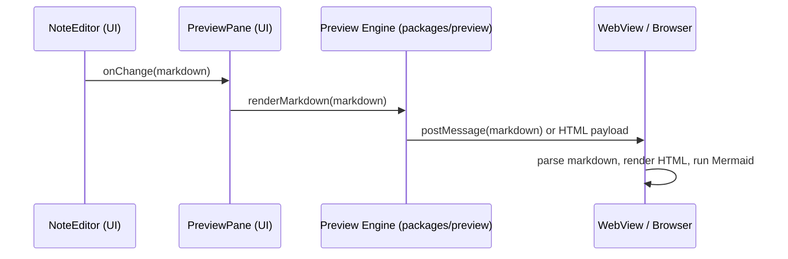

# ARCHITECTURE.md — MarkoPad Architecture

This document describes the architecture of **MarkoPad**, a cross-platform Markdown note-taking app with real-time preview and Mermaid diagram support.

The goals of this architecture are:

- Provide a clear separation of concerns between domain logic, UI, and platform-specific integrations.
- Make the codebase easy to extend (e.g. search, tagging, plugins) without large rewrites.
- Support multiple desktop targets (Windows, Linux via web) from a shared TypeScript/React codebase.
- Be friendly to both human developers and AI coding agents.

For detailed functional requirements, see `requirements.md`. For setup and usage, see `README.md`.

---

## 1. High-Level Overview

### 1.1 Layers

At a high level, MarkoPad is organized into four main layers:

1. **Domain (Core) Layer**
   - Note model, workspace management, storage abstraction, search/index.
2. **Application / UI Layer**
   - React / React Native components, state management, navigation, layout.
3. **Preview Layer**
   - Markdown + Mermaid rendering logic, WebView integration.
4. **Platform Shells**
   - Windows app (React Native for Windows).
   - Web app for Linux and other platforms.

### 1.2 High-Level Diagram



- Platform shells host the UI layer.
- UI layer orchestrates interactions between the user, domain logic, and preview engine.
- Domain layer persists data to the file system and provides query/search capabilities.
- Preview layer turns Markdown content into rendered HTML + Mermaid diagrams.

---

## 2. Repository Structure

Target structure (may evolve as the project grows):

```text
markopad/
  README.md
  requirements.md
  ARCHITECTURE.md
  AGENTS.md
  package.json
  pnpm-workspace.yaml

  apps/
    windows/          # React Native Windows app shell
    web/              # Web / React Native Web app shell

  packages/
    core/             # Domain logic: notes, workspace, storage abstraction, search/index
    ui/               # Shared UI components: note list, editor, layout, etc.
    preview/          # Markdown + Mermaid preview logic: WebView integration, HTML template

  .github/
    workflows/        # CI (lint, test, build)
    agents/           # Optional Copilot agent configuration
```

Each package and app has its own `package.json` and TypeScript configuration as needed. The workspace is managed via `pnpm-workspace.yaml`.

---

## 3. Domain / Core Layer (`packages/core`)

The **core** package holds the domain model and business logic and should be free of any UI or platform-specific details.

### 3.1 Responsibilities

- Model notes and workspaces.
- Scan the workspace folder for `.md` files.
- Load, create, rename, and delete notes via a storage abstraction.
- Maintain an in-memory index of notes (for listing and searching).
- Provide search APIs (e.g. full-text search, tag-based search in the future).

### 3.2 Key Concepts

```ts
// Example (as described in requirements.md)
export type NoteId = string; // e.g., relative file path from workspace root

export interface Note {
  id: NoteId;
  title: string;
  filePath: string;
  content: string;
  createdAt: Date;
  updatedAt: Date;
}

export interface WorkspaceConfig {
  workspaceRoot: string;
  lastOpenedNoteId?: NoteId;
}
```

### 3.3 Storage Abstraction

The core layer should define an interface for storage operations, e.g.:

```ts
export interface NoteStorage {
  listNotes(): Promise<Note[]>;
  loadNote(id: NoteId): Promise<Note | null>;
  saveNote(note: Note): Promise<void>;
  renameNote(id: NoteId, newTitle: string): Promise<Note>;
  deleteNote(id: NoteId): Promise<void>;
}
```

Platform-specific code (Node `fs`, native modules, browser APIs) can implement this interface in separate adapters that are wired up in the platform shells or a small infrastructure layer. This allows:

- Easy mocking for tests.
- Future support for alternative backends (e.g. virtual file systems, remote sync).

### 3.4 Search and Indexing

The core layer can maintain a simple in-memory index for:

- Listing notes sorted by title or last modified time.
- Filtering notes by text query (full-text search) or tags (future).

Search should be designed to be replaceable (e.g. from simple substring search to a more advanced index) without changing the UI layer.

---

## 4. UI Layer (`packages/ui`)

The **ui** package provides reusable React / React Native components and hooks. It should be mostly platform-agnostic.

### 4.1 Responsibilities

- Present data from the core layer.
- Handle user interactions (select note, edit, create, rename, delete).
- Manage view state (selected note, search query, layout state, etc.).
- Integrate with the preview layer for live rendering.

### 4.2 Key Components (Conceptual)

- `WorkspaceProvider`
  - React context providing workspace and note operations to child components.
- `NoteList`
  - Displays available notes and allows selecting/renaming/deleting them.
- `NoteEditor`
  - Text editing area for the current note.
- `PreviewPane`
  - Container component that integrates with the preview engine (from `packages/preview`).
- `AppLayout`
  - Split-view layout: note list / editor / preview.

### 4.3 State Management

Initially, state can be managed with React hooks + context. For example:

- `useWorkspace()` hook to access notes and operations.
- `useCurrentNote()` hook for the active note.
- `usePreview()` hook for preview-specific state if needed.

If the UI grows more complex, a dedicated state management library (Zustand, Redux, etc.) can be introduced, but this is not required for the initial version.

---

## 5. Preview Layer (`packages/preview`)

The **preview** package is responsible for turning Markdown into rendered HTML, including Mermaid diagrams, and integrating this with a WebView component.

### 5.1 Responsibilities

- Provide an API to convert Markdown to HTML.
- Inject necessary scripts (Markdown parser, Mermaid) into the preview environment.
- Handle communication between React Native and the WebView (e.g. via `postMessage`).

### 5.2 Flow



In many cases, the preview engine may simply send raw Markdown to the WebView, which holds an HTML template that:

1. Parses Markdown into HTML.
2. Locates ` ```mermaid ` code blocks.
3. Renders them as diagrams using Mermaid.

The preview layer should hide the details of which Markdown library and Mermaid integration are used, so the UI layer just uses a simple interface like:

```ts
export interface PreviewEngine {
  htmlTemplate: string; // base HTML for the WebView
  // Optionally, helpers or configuration for messaging
}
```

---

## 6. Platform Shells (`apps/windows`, `apps/web`)

### 6.1 Windows App (`apps/windows`)

The Windows app hosts the React Native Windows application.

Responsibilities:

- Initialize the React Native runtime.
- Provide platform-specific bindings:
  - File dialogs (select workspace folder).
  - File system access (via native modules or Node-style APIs, depending on stack).
- Wire up the core storage implementation (e.g. Node `fs` or a native file API) to the `NoteStorage` interface.

### 6.2 Web App (`apps/web`)

The Web app hosts the application for browsers (primarily targeting Linux desktop users via browser or desktop wrapper).

Responsibilities:

- Initialize the React / React Native Web runtime.
- Provide browser-based file system integration if available, or a fallback model:
  - For example, the user may choose a directory via the File System Access API (where supported) or a simulated workspace stored in IndexedDB (TBD).
- Wire up a `NoteStorage` implementation appropriate for the browser environment.

The web app should aim to reuse as much of the `packages/ui` and `packages/core` code as possible, only diverging in the platform-specific storage adapter and startup logic.

---

## 7. Cross-Cutting Concerns

### 7.1 Error Handling

- Core layer functions should return clear, typed errors where possible.
- UI components should present user-friendly messages and avoid crashing the app.
- Logging can initially be minimal (console), with room for growth (e.g. structured logs) if needed.

### 7.2 Performance

Performance constraints (from `requirements.md`):

- App startup under ~1 second for typical workspaces.
- Preview updates within ~50–100ms for typical note sizes.
- Support for workspaces with thousands of notes.

Key architectural considerations:

- Avoid loading full note contents into memory when only listing notes.
- Debounce autosave and preview updates.
- Use virtualized lists if necessary for large note collections.

### 7.3 Testing

- **Core layer**
  - Unit tests for storage operations (with mock adapters).
  - Tests for indexing and search.
- **UI layer**
  - Component tests for key UI flows (note selection, editing, deletion).
- **Preview layer**
  - Tests for Markdown → HTML helpers where feasible.
  - Integration tests may be needed for WebView behavior.

CI (in `.github/workflows`) should run:

- Type checks.
- Linting.
- Unit tests.

---

## 8. Extension Points and Future Work

The architecture is designed to support future extensions without major rewrites.

Possible future features and how they fit:

1. **Full-text search index**
   - Add a dedicated indexer in `packages/core`.
   - Provide search APIs consumed by `packages/ui`.

2. **Tags and metadata**
   - Extend the `Note` model with tags and front matter parsing.
   - Update UI components and storage layer accordingly.

3. **Backlinks and graph view**
   - Implement link parsing in `packages/core`.
   - Add visualization components in `packages/ui` (e.g. a graph view).
   - Preview layer can display link previews if needed.

4. **Plugin system**
   - Define an extension API in `packages/core`/`packages/ui`.
   - Allow plugins to hook into commands, rendering, or metadata.

5. **Additional platforms (e.g. mobile)**
   - Add new `apps/*` shells (Android/iOS) reusing `packages/ui`, `packages/core`, and `packages/preview`.

---

## 9. Design Principles

A few guiding principles for future changes:

1. **Separation of concerns**
   - Domain logic should not depend on UI or platform frameworks.
   - UI should talk to core through well-defined interfaces.

2. **Replaceable components**
   - Storage, preview engine, and search implementations should be replaceable without massive rewrites.

3. **Developer and agent friendliness**
   - Keep modules small and focused.
   - Favor clear, explicit behavior over clever tricks.
   - Document important decisions and invariants in code comments or short docs.

4. **Incremental evolution**
   - Prefer small, incremental improvements over large rewrites.
   - Keep tests and documentation up to date with architectural changes.

---

This document is a living artifact. As MarkoPad evolves, please update `ARCHITECTURE.md` whenever architectural changes are made or new patterns are introduced.
